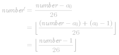

#### 方法一：数学

在考虑如何将列序号转换成列名称之前，先考虑相反的问题，即如何将列名称转换成列序号。读者可以参考「[171. Excel表列序号的官方题解](https://leetcode-cn.com/problems/excel-sheet-column-number/solution/excelbiao-lie-xu-hao-by-leetcode-solutio-r29l/)」。

引用该题解的结论，如果列名称的长度为 *n*，每一位对应的序号为 ![\[a_{n-1},a_{n-2},\ldots,a_0\] ](./p___a_{n-1},_a_{n-2},_ldots,_a_0__.png) ，其中对于任意   都有  ，则列名称对应的列序号为：

 

将列序号转换成列名称，则是在已知   的情况下，解出 *a_0* 到 *a_{n-1}* 的值。

分离出 *a_0* 项，提出其余项的公因数 *26*，上式可以改写为：

 

将等式两边同时减 *1*，得：

 

由于  ，由上式可知，*a_0 - 1* 是   除以 *26* 的余数。

这样我们就得到了 *a_0* 的值。

在得到 *a_0* 的值之后，令  ，则有：

 

于是使用同样的方法，可以得到 *a_1* 的值。

上述过程是一个循环的过程，直至   时停止。此时我们就得到了 *a_0* 到 *a_{n-1}* 的值。拼接这些值对应的字母，即得到了答案。

代码实现时，由于我们计算列名称的顺序是从右往左，因此需要将拼接后的结果反转。

```C++ [sol1-C++]
class Solution {
public:
    string convertToTitle(int columnNumber) {
        string ans;
        while (columnNumber > 0) {
            int a0 = (columnNumber - 1) % 26 + 1;
            ans += a0 - 1 + 'A';
            columnNumber = (columnNumber - a0) / 26;
        }
        reverse(ans.begin(), ans.end());
        return ans;
    }
};
```

```Java [sol1-Java]
class Solution {
    public String convertToTitle(int columnNumber) {
        StringBuffer sb = new StringBuffer();
        while (columnNumber > 0) {
            int a0 = (columnNumber - 1) % 26 + 1;
            sb.append((char)(a0 - 1 + 'A'));
            columnNumber = (columnNumber - a0) / 26;
        }
        return sb.reverse().toString();
    }
}
```

```C# [sol1-C#]
public class Solution {
    public string ConvertToTitle(int columnNumber) {
        StringBuilder sb = new StringBuilder();
        while (columnNumber > 0) {
            int a0 = (columnNumber - 1) % 26 + 1;
            sb.Append((char)(a0 - 1 + 'A'));
            columnNumber = (columnNumber - a0) / 26;
        }
        StringBuilder columnTitle = new StringBuilder();
        for (int i = sb.Length - 1; i >= 0; i--) {
            columnTitle.Append(sb[i]);
        }
        return columnTitle.ToString();
    }
}
```

```JavaScript [sol1-JavaScript]
var convertToTitle = function(columnNumber) {
    let ans = [];
    while (columnNumber > 0) {
        const a0 = (columnNumber - 1) % 26 + 1;
        ans.push(String.fromCharCode(a0 - 1 + 'A'.charCodeAt()));
        columnNumber = Math.floor((columnNumber - a0) / 26);
    }
    ans.reverse();
    return ans.join('');
};
```

```go [sol1-Golang]
func convertToTitle(columnNumber int) string {
    ans := []byte{}
    for columnNumber > 0 {
        a0 := (columnNumber-1)%26 + 1
        ans = append(ans, 'A'+byte(a0-1))
        columnNumber = (columnNumber - a0) / 26
    }
    for i, n := 0, len(ans); i < n/2; i++ {
        ans[i], ans[n-1-i] = ans[n-1-i], ans[i]
    }
    return string(ans)
}
```

```C [sol1-C]
void reverse(char* str, int strSize) {
    int left = 0, right = strSize - 1;
    while (left < right) {
        char tmp = str[left];
        str[left] = str[right], str[right] = tmp;
        left++;
        right--;
    }
}

char* convertToTitle(int columnNumber) {
    char* ans = malloc(sizeof(char) * 8);
    int ansSize = 0;
    while (columnNumber > 0) {
        int a0 = (columnNumber - 1) % 26 + 1;
        ans[ansSize++] = a0 - 1 + 'A';
        columnNumber = (columnNumber - a0) / 26;
    }
    ans[ansSize] = '\0';
    reverse(ans, ansSize);
    return ans;
}
```

```Python [sol1-Python3]
class Solution:
    def convertToTitle(self, columnNumber: int) -> str:
        ans = list()
        while columnNumber > 0:
            a0 = (columnNumber - 1) % 26 + 1
            ans.append(chr(a0 - 1 + ord("A")))
            columnNumber = (columnNumber - a0) // 26
        return "".join(ans[::-1])
```

对于整数 *n*，若 *n* 能被 *26* 整除，则有：

 

其中  。

因此有：

 

这里我们用到了   这一性质。

据此，我们得到另外一种简洁的写法：

```C++ [sol2-C++]
class Solution {
public:
    string convertToTitle(int columnNumber) {
        string ans;
        while (columnNumber > 0) {
            --columnNumber;
            ans += columnNumber % 26 + 'A';
            columnNumber /= 26;
        }
        reverse(ans.begin(), ans.end());
        return ans;
    }
};
```

```Java [sol2-Java]
class Solution {
    public String convertToTitle(int columnNumber) {
        StringBuffer sb = new StringBuffer();
        while (columnNumber != 0) {
            columnNumber--;
            sb.append((char)(columnNumber % 26 + 'A'));
            columnNumber /= 26;
        }
        return sb.reverse().toString();
    }
}
```

```C# [sol2-C#]
public class Solution {
    public string ConvertToTitle(int columnNumber) {
        StringBuilder sb = new StringBuilder();
        while (columnNumber != 0) {
            columnNumber--;
            sb.Append((char)(columnNumber % 26 + 'A'));
            columnNumber /= 26;
        }
        StringBuilder columnTitle = new StringBuilder();
        for (int i = sb.Length - 1; i >= 0; i--) {
            columnTitle.Append(sb[i]);
        }
        return columnTitle.ToString();
    }
}
```

```JavaScript [sol2-JavaScript]
var convertToTitle = function(columnNumber) {
    const sb = [];
    while (columnNumber !== 0) {
        columnNumber--;
        sb.push(String.fromCharCode(columnNumber % 26 + 'A'.charCodeAt()));
        columnNumber = Math.floor(columnNumber / 26);
    }
    return sb.reverse().join('');
};
```

```go [sol2-Golang]
func convertToTitle(columnNumber int) string {
    ans := []byte{}
    for columnNumber > 0 {
        columnNumber--
        ans = append(ans, 'A'+byte(columnNumber%26))
        columnNumber /= 26
    }
    for i, n := 0, len(ans); i < n/2; i++ {
        ans[i], ans[n-1-i] = ans[n-1-i], ans[i]
    }
    return string(ans)
}
```

```C [sol2-C]
void reverse(char* str, int strSize) {
    int left = 0, right = strSize - 1;
    while (left < right) {
        char tmp = str[left];
        str[left] = str[right], str[right] = tmp;
        left++;
        right--;
    }
}

char* convertToTitle(int columnNumber) {
    char* ans = malloc(sizeof(char) * 8);
    int ansSize = 0;

    while (columnNumber > 0) {
        --columnNumber;
        ans[ansSize++] = columnNumber % 26 + 'A';
        columnNumber /= 26;
    }
    ans[ansSize] = '\0';
    reverse(ans, ansSize);
    return ans;
}
```

```Python [sol2-Python3]
class Solution:
    def convertToTitle(self, columnNumber: int) -> str:
        ans = list()
        while columnNumber > 0:
            columnNumber -= 1
            ans.append(chr(columnNumber % 26 + ord("A")))
            columnNumber //= 26
        return "".join(ans[::-1])
```

**复杂度分析**

- 时间复杂度： 。时间复杂度即为将   转换成 *26* 进制的位数。

- 空间复杂度：*O(1)*。返回值不计入空间复杂度。注意，在某些语言（比如 Java、C#、JavaScript）中字符串是不可变的，因此我们需要额外的   的空间来存储返回值的中间结果。但是我们忽略这一复杂度分析，因为这依赖于语言的细节。